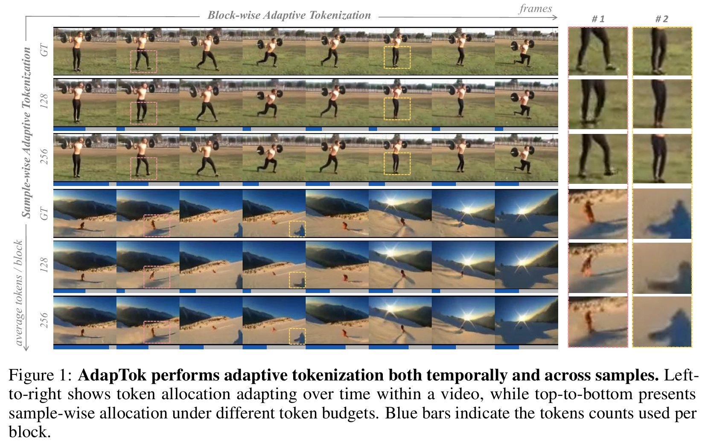
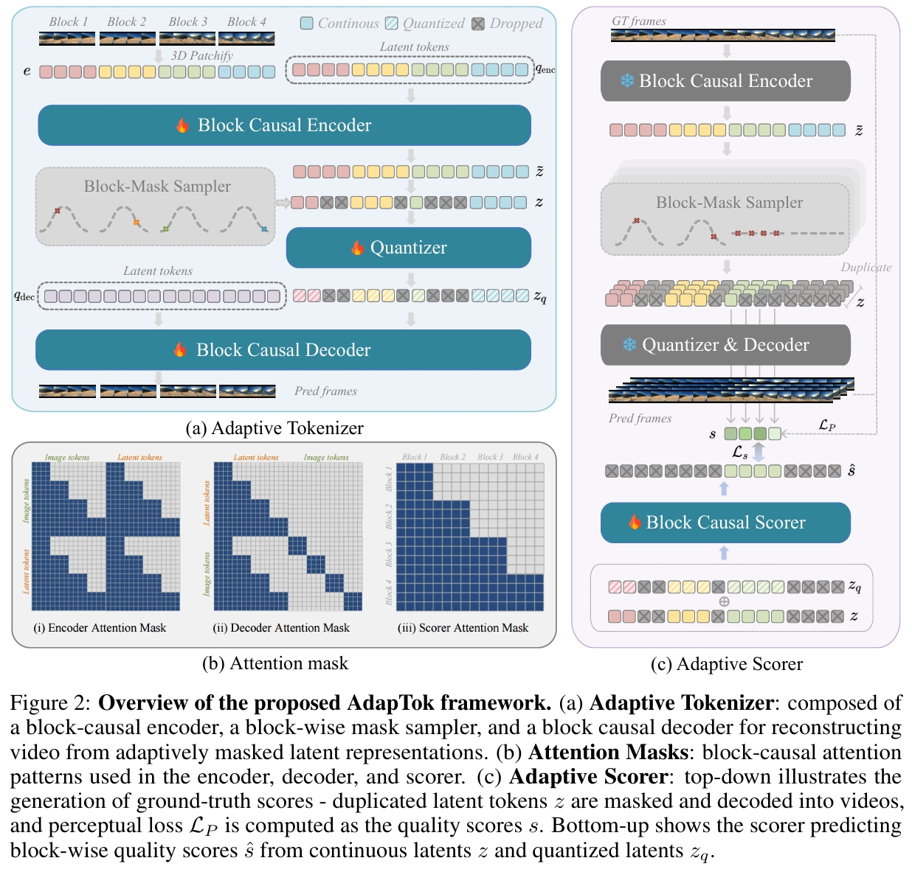

# AdapTok: Learning Adaptive and Temporally Causal Video Tokenization in a 1D Latent Space

[](https://arxiv.org/abs/2505.17011)

<p align="center">

<p>

## Overview

We propose AdapTok, an adaptive temporal causal video tokenizer that can flexibly allocate tokens for different frames based on video content. AdapTok is equipped with a block-wise masking strategy that randomly drops tail tokens of each block during training, and a block causal scorer to predict the reconstruction quality of video frames using different numbers of tokens. During inference, an adaptive token allocation strategy based on integer linear programming is further proposed to adjust token usage given predicted scores. Such design allows for sample-wise, content-aware, and temporally dynamic token allocation under a controllable overall budget. Extensive experiments for video reconstruction and generation on UCF-101 and Kinetics-600 demonstrate the effectiveness of our approach. Without additional image data, AdapTok consistently improves reconstruction quality and generation performance under different token budgets, allowing for more scalable and token-efficient generative video modeling.

<p align="center">

<p>


## Get Started

- Installation

```
conda create -n adaptok python=3.10
conda activate adaptok
pip install torch==2.5.1 torchvision==0.20.1 torchaudio==2.5.1 --index-url https://download.pytorch.org/whl/cu121
pip install -r requirements.txt
```

- Dataset

Prepare the datasets following [data/README.md](data/README.md).


## Training

### Training AdapTok

```
bash scripts/train_adaptok.sh
```

> To enable multi-nodes training, you need to config `MASTER_ADDR`, `NNODES`, etc, in the script.

### Training AdapTok-Scorer

```
bash scripts/train_adaptok_scorer.sh
```

### Training AdapTok-AR on UCF101 dataset

- prepare ar annotations

```
bash scripts/prepare_annotations_for_ar.sh
```

- train AdapTok-AR

```
bash scripts/train_adaptok_ar.sh
```

### Training AdapTok-FP (frame prediction) on Kinetics-600 dataset

- prepare ar-fp annotations

```
bash scripts/prepare_annotations_for_fp.sh
```

- post-process annotations

```
bash scripts/prepare_annotations_for_fp_post_processing.sh
```

- train AdapTok-FP
```
bash scripts/train_adaptok_ar_fp.sh
```

## Evaluation

### Adaptive Reconstruction

```
bash scripts/eval_adaptok.sh
```

### UCF-101 Class-conditional Generation

```
bash scripts/eval_adaptok_ar.sh
```

### Kinetics-600 Frame Prediction

```
bash scripts/eval_adaptok_ar_fp.sh
```

## Acknowledgement

Our code is built upon [LARP](https://github.com/hywang66/LARP). Thanks for their great work.


## Citation

If you find this code useful in your research, please consider citing:
```
@misc{li2025learningadaptivetemporallycausal,
      title={Learning Adaptive and Temporally Causal Video Tokenization in a 1D Latent Space}, 
      author={Yan Li and Changyao Tian and Renqiu Xia and Ning Liao and Weiwei Guo and Junchi Yan and Hongsheng Li and Jifeng Dai and Hao Li and Xue Yang},
      year={2025},
      eprint={2505.17011},
      archivePrefix={arXiv},
      primaryClass={cs.CV},
      url={https://arxiv.org/abs/2505.17011}, 
}
```